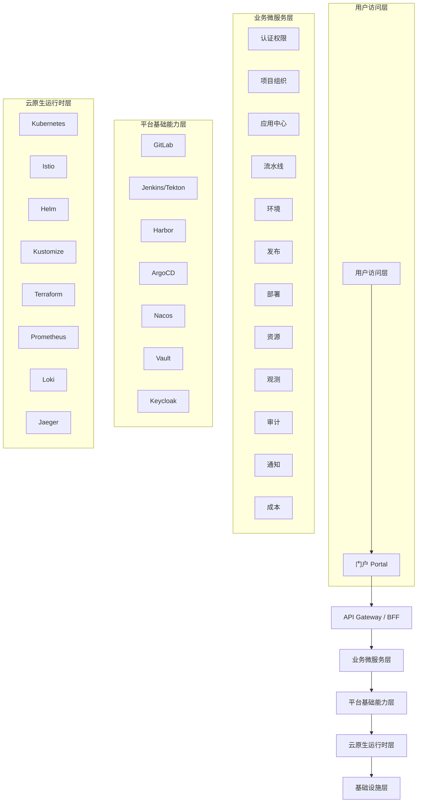
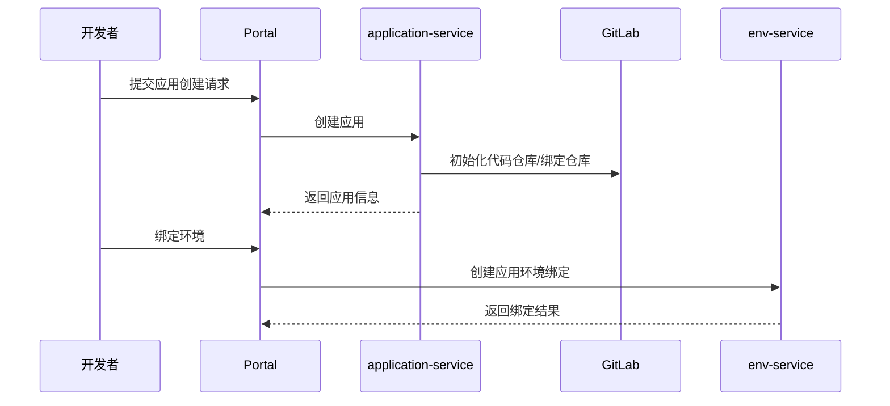
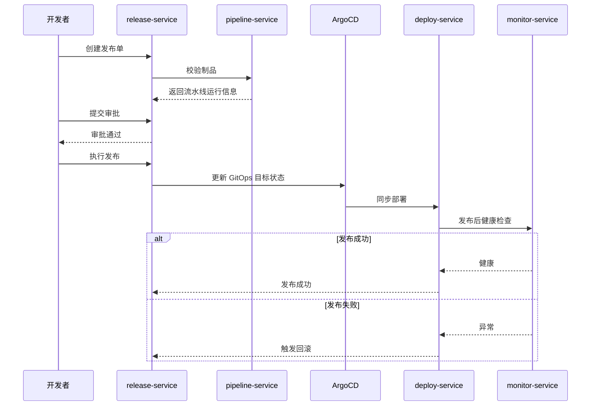
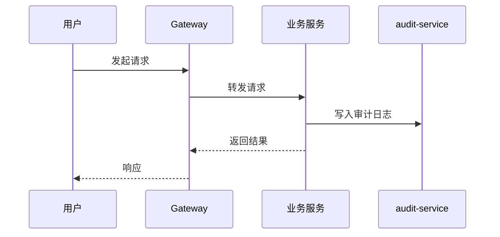
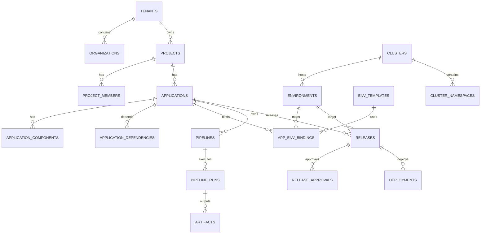

# 云原生应用研发交付平台技术方案（完整版）

> 版本：v1.1  
> 文档类型：完整技术方案 / 架构设计 / 数据库设计 / API设计 / 工程落地说明  
> 后端技术栈：**Go 微服务（Gin + GORM）**  
> 目标：构建一款**面向开发者、以应用为中心、开箱即用**的一站式开发、测试、发布、运维平台。

---

# 目录

- [1. 项目概述](#1-项目概述)
- [2. 技术栈与选型说明](#2-技术栈与选型说明)
- [3. 总体架构设计](#3-总体架构设计)
- [4. 微服务拆分设计](#4-微服务拆分设计)
- [5. 核心业务流程设计](#5-核心业务流程设计)
- [6. 数据库设计](#6-数据库设计)
- [7. 完整 MySQL DDL](#7-完整-mysql-ddl)
- [8. API 设计规范](#8-api-设计规范)
- [9. 全模块 API 详细定义](#9-全模块-api-详细定义)
- [10. Go / Gin 项目结构示例](#10-go--gin-项目结构示例)
- [11. 配置、安全与可观测设计](#11-配置安全与可观测设计)
- [12. CI/CD 与发布部署设计](#12-cicd-与发布部署设计)
- [13. Helm / Kubernetes 模板示例](#13-helm--kubernetes-模板示例)
- [14. OpenAPI 结构示例](#14-openapi-结构示例)
- [15. 非功能性设计](#15-非功能性设计)
- [16. 分阶段实施计划](#16-分阶段实施计划)
- [17. 风险与治理建议](#17-风险与治理建议)
- [18. 附录：SQL 初始化与脚手架建议](#18-附录sql-初始化与脚手架建议)

---

# 1. 项目概述

## 1.1 建设目标

建设一个大型企业标准云原生应用研发交付平台，统一提供：

- 应用管理
- 项目与团队管理
- 研发工作流管理
- 环境管理
- 发布与部署
- 运维与可观测
- 集群与资源治理
- 配置与密钥管理
- 权限与审计
- 成本治理

实现研发交付闭环：

**代码 → 构建 → 测试 → 制品 → 发布 → 部署 → 观测 → 回滚 → 治理**

---

## 1.2 平台定位

平台是一套**面向开发者的应用交付控制面**，核心关注点不是“底层资源如何管理”，而是“应用如何被标准化、高效、可追溯地研发、交付和运行”。

---

## 1.3 适用场景

- 企业内部 PaaS / DevOps 平台
- 多团队、多项目、多环境管理
- 微服务 / 云原生应用统一交付
- 混合云 / 多集群交付治理
- 中大型组织研发效能提升

---

# 2. 技术栈与选型说明

## 2.1 技术栈总览

| 分类 | 技术 |
|---|---|
| 门户与后端 | Go 微服务（Gin + GORM） |
| 代码仓库 | GitLab |
| CI | Jenkins / Tekton |
| 镜像仓库 | Harbor |
| CD | Argo CD |
| 编排平台 | Kubernetes |
| 环境模板 | Helm + Kustomize |
| 资源编排 | Terraform |
| 配置中心 | Nacos |
| 密钥管理 | Vault |
| 监控 | Prometheus + Grafana |
| 日志 | Loki |
| 链路追踪 | Jaeger / SkyWalking |
| 服务网格 | Istio |
| 质量与安全 | SonarQube + Trivy + ZAP |
| 成本治理 | Kubecost |
| 统一认证 | Keycloak |
| 数据库 | MySQL 8.0 |
| 缓存 | Redis（建议） |
| 消息队列 | Kafka / RabbitMQ（建议） |

---

## 2.2 选型理由

### Go + Gin + GORM
- Go 适合微服务场景，资源占用低、并发能力强、部署简单
- Gin 轻量、高性能、生态成熟
- GORM 适合中后台标准 CRUD 场景，配合 Repository 模式易维护

### GitLab + Jenkins/Tekton + Harbor + Argo CD
- 构成完整 CI/CD 工具链
- 支持 GitOps
- 与 Kubernetes 集成成熟

### Helm + Kustomize + Terraform
- Helm：标准化应用模板
- Kustomize：多环境差异管理
- Terraform：基础设施即代码

### Nacos + Vault + Keycloak
- 分别解决配置、密钥、认证问题
- 职责清晰，利于平台治理

### Prometheus + Grafana + Loki + Jaeger
- 指标、图表、日志、链路闭环
- 云原生社区标准组合

---

# 3. 总体架构设计

###### 3.1 总体架构原则

1. 以应用为中心
2. 声明式交付
3. 研发运维一体化
4. 多环境、多集群、多租户
5. 全链路可观测、可审计、可回滚
6. 平台治理与业务解耦
7. 基于云原生标准构建

---

## 3.2 Mermaid 微服务总体架构图

```mermaid
flowchart TB
    user[开发者 / 测试 / 运维 / 管理员] --> portal[Portal 控制台]

    portal --> gateway[API Gateway / BFF]

    gateway --> authsvc[auth-service]
    gateway --> projectsvc[project-service]
    gateway --> appsvc[application-service]
    gateway --> pipelinesvc[pipeline-service]
    gateway --> envsvc[env-service]
    gateway --> releasesvc[release-service]
    gateway --> deploysvc[deploy-service]
    gateway --> clustersvc[cluster-service]
    gateway --> resourcesvc[resource-service]
    gateway --> monitorsvc[monitor-service]
    gateway --> configsvc[config-service]
    gateway --> secretsvc[secret-service]
    gateway --> auditsvc[audit-service]
    gateway --> notifysvc[notification-service]
    gateway --> costsvc[cost-service]

    authsvc --> keycloak[Keycloak]
    configsvc --> nacos[Nacos]
    secretsvc --> vault[Vault]
    costsvc --> kubecost[Kubecost]

    pipelinesvc --> gitlab[GitLab]
    pipelinesvc --> jenkins[Jenkins / Tekton]
    pipelinesvc --> sonar[SonarQube]
    pipelinesvc --> trivy[Trivy]
    pipelinesvc --> harbor[Harbor]

    releasesvc --> argocd[Argo CD]
    deploysvc --> k8s[Kubernetes]
    envsvc --> helm[Helm]
    envsvc --> kustomize[Kustomize]
    resourcesvc --> terraform[Terraform]
    deploysvc --> istio[Istio]

    monitorsvc --> prometheus[Prometheus]
    monitorsvc --> grafana[Grafana]
    monitorsvc --> loki[Loki]
    monitorsvc --> jaeger[Jaeger / SkyWalking]

    appsvc --> mysql1[(MySQL)]
    projectsvc --> mysql2[(MySQL)]
    pipelinesvc --> mysql3[(MySQL)]
    envsvc --> mysql4[(MySQL)]
    releasesvc --> mysql5[(MySQL)]
    deploysvc --> mysql6[(MySQL)]
    resourcesvc --> mysql7[(MySQL)]
    auditsvc --> mysql8[(MySQL)]
    notifysvc --> mysql9[(MySQL)]
    costsvc --> mysql10[(MySQL)]

    subgraph runtime[云原生运行时]
        k8s
        istio
        argocd
        helm
        kustomize
    end

    subgraph cicd[研发交付链路]
        gitlab
        jenkins
        harbor
        sonar
        trivy
    end

    subgraph observability[可观测]
        prometheus
        grafana
        loki
        jaeger
    end
```


3.3 研发交付流程图

3.4 平台分层图

# 4.微服务拆分设计

## 4.1 微服务列表

| 服务名               | 职责                               |
| -------------------- | ---------------------------------- |
| auth-service         | 用户、角色、权限、认证、统一登录   |
| project-service      | 租户、组织、项目、成员管理         |
| application-service  | 应用、组件、依赖、应用模型管理     |
| pipeline-service     | 流水线、构建、制品、GitLab/CI 集成 |
| env-service          | 环境、环境模板、绑定、变量管理     |
| release-service      | 发布单、审批、变更、回滚           |
| deploy-service       | ArgoCD 同步、K8s 部署、运维动作    |
| cluster-service      | 集群、命名空间、接入管理           |
| resource-service     | 配额、资源池、容量、资源编排       |
| monitor-service      | 监控、日志、链路、告警接口聚合     |
| config-service       | Nacos 配置管理                     |
| secret-service       | Vault 密钥管理                     |
| audit-service        | 审计日志、操作记录、导出           |
| notification-service | 通知发送、模板、通道管理           |
| cost-service         | 成本统计、项目成本、应用成本       |

## 4.2 服务边界原则

1. 每个服务只聚焦一个领域能力
2. 每个服务独立数据库 / Schema
3. 跨服务通过 HTTP/gRPC 或事件通信
4. 认证中心化，授权可局部化
5. 审计、通知、配置、密钥等能力平台统一提供

## 4.3 服务通信建议

| 场景           | 建议方式                |
| -------------- | ----------------------- |
| 前端到服务     | API Gateway + HTTP/JSON |
| 服务间同步调用 | HTTP REST / gRPC        |
| 服务间异步事件 | Kafka / RabbitMQ        |
| 跨服务状态协同 | 事件驱动 + 最终一致性   |
| 审计与通知     | 异步消息优先            |

------

# 5. 核心业务流程设计

## 5.1 应用创建流程


## 5.2 发布流程


## 5.3 审计流程


# 6. 数据库设计

## 6.1 设计原则

结合数据库设计范式与工程化实践：

1. 遵循 1NF / 2NF / 3NF
2. 高频查询适度反范式
3. 一个表描述一类核心实体
4. 多对多通过中间表处理
5. 树形结构采用邻接表
6. 统一审计字段
7. 尽量避免跨服务物理外键，使用逻辑关联
8. 支持后续分库分表、归档和读写分离

------

## 6.2 通用字段规范

所有业务主表建议包含：

- `id`
- `create_time`
- `update_time`
- `create_by`
- `update_by`
- `is_deleted`
- `status`

------

## 6.3 分库建议

| 服务                 | DB              |
| -------------------- | --------------- |
| auth-service         | iam_db          |
| project-service      | org_db          |
| application-service  | app_db          |
| pipeline-service     | devops_db       |
| env-service          | env_db          |
| release-service      | release_db      |
| deploy-service       | deploy_db       |
| cluster-service      | infra_db        |
| resource-service     | resource_db     |
| config-service       | config_db       |
| secret-service       | secret_db       |
| audit-service        | audit_db        |
| notification-service | notification_db |
| cost-service         | cost_db         |


# 7. 完整 MySQL DDL

> 说明：以下为可执行版本，建议按数据库拆分为 `sql/*.sql` 文件。

## 7.1 通用建议

```
sql自动换行
复制
1-- 建议先设置时区与字符集
2SET NAMES utf8mb4;
3SET FOREIGN_KEY_CHECKS = 0;
```

------

## 7.2 iam_db（认证与权限）

```sql
-- 建议先设置时区与字符集
SET NAMES utf8mb4;
SET FOREIGN_KEY_CHECKS = 0;
```

------

## 7.3 org_db（租户/组织/项目）

```sql
CREATE DATABASE IF NOT EXISTS iam_db DEFAULT CHARACTER SET utf8mb4 COLLATE utf8mb4_unicode_ci;
USE iam_db;

CREATE TABLE IF NOT EXISTS users (
  id BIGINT PRIMARY KEY AUTO_INCREMENT COMMENT '主键',
  user_uuid VARCHAR(64) NOT NULL UNIQUE COMMENT '用户唯一标识',
  username VARCHAR(64) NOT NULL UNIQUE COMMENT '用户名',
  email VARCHAR(128) NULL UNIQUE COMMENT '邮箱',
  phone VARCHAR(32) NULL UNIQUE COMMENT '手机号',
  nickname VARCHAR(64) NULL COMMENT '昵称',
  avatar_url VARCHAR(255) NULL COMMENT '头像',
  source VARCHAR(32) DEFAULT 'keycloak' COMMENT '用户来源',
  last_login_time DATETIME NULL COMMENT '最后登录时间',
  status TINYINT DEFAULT 1 COMMENT '状态1正常0禁用',
  create_time DATETIME DEFAULT CURRENT_TIMESTAMP COMMENT '创建时间',
  update_time DATETIME DEFAULT CURRENT_TIMESTAMP ON UPDATE CURRENT_TIMESTAMP COMMENT '更新时间',
  create_by BIGINT DEFAULT NULL COMMENT '创建人',
  update_by BIGINT DEFAULT NULL COMMENT '更新人',
  is_deleted TINYINT DEFAULT 0 COMMENT '是否删除'
) ENGINE=InnoDB DEFAULT CHARSET=utf8mb4 COMMENT='用户表';

CREATE TABLE IF NOT EXISTS roles (
  id BIGINT PRIMARY KEY AUTO_INCREMENT COMMENT '主键',
  role_code VARCHAR(64) NOT NULL UNIQUE COMMENT '角色编码',
  role_name VARCHAR(128) NOT NULL COMMENT '角色名称',
  role_type VARCHAR(32) DEFAULT 'custom' COMMENT '角色类型',
  description VARCHAR(255) NULL COMMENT '描述',
  status TINYINT DEFAULT 1 COMMENT '状态',
  create_time DATETIME DEFAULT CURRENT_TIMESTAMP COMMENT '创建时间',
  update_time DATETIME DEFAULT CURRENT_TIMESTAMP ON UPDATE CURRENT_TIMESTAMP COMMENT '更新时间',
  create_by BIGINT DEFAULT NULL COMMENT '创建人',
  update_by BIGINT DEFAULT NULL COMMENT '更新人',
  is_deleted TINYINT DEFAULT 0 COMMENT '是否删除'
) ENGINE=InnoDB DEFAULT CHARSET=utf8mb4 COMMENT='角色表';

CREATE TABLE IF NOT EXISTS permissions (
  id BIGINT PRIMARY KEY AUTO_INCREMENT COMMENT '主键',
  perm_code VARCHAR(128) NOT NULL UNIQUE COMMENT '权限编码',
  perm_name VARCHAR(128) NOT NULL COMMENT '权限名称',
  resource_type VARCHAR(32) NULL COMMENT '资源类型',
  http_method VARCHAR(16) NULL COMMENT 'HTTP方法',
  path VARCHAR(255) NULL COMMENT '接口路径',
  description VARCHAR(255) NULL COMMENT '描述',
  status TINYINT DEFAULT 1 COMMENT '状态',
  create_time DATETIME DEFAULT CURRENT_TIMESTAMP COMMENT '创建时间',
  update_time DATETIME DEFAULT CURRENT_TIMESTAMP ON UPDATE CURRENT_TIMESTAMP COMMENT '更新时间',
  create_by BIGINT DEFAULT NULL COMMENT '创建人',
  update_by BIGINT DEFAULT NULL COMMENT '更新人',
  is_deleted TINYINT DEFAULT 0 COMMENT '是否删除'
) ENGINE=InnoDB DEFAULT CHARSET=utf8mb4 COMMENT='权限表';

CREATE TABLE IF NOT EXISTS user_roles (
  id BIGINT PRIMARY KEY AUTO_INCREMENT COMMENT '主键',
  user_id BIGINT NOT NULL COMMENT '用户ID',
  role_id BIGINT NOT NULL COMMENT '角色ID',
  create_time DATETIME DEFAULT CURRENT_TIMESTAMP COMMENT '创建时间',
  UNIQUE KEY uk_user_role(user_id, role_id),
  KEY idx_role_id(role_id)
) ENGINE=InnoDB DEFAULT CHARSET=utf8mb4 COMMENT='用户角色关系表';

CREATE TABLE IF NOT EXISTS role_permissions (
  id BIGINT PRIMARY KEY AUTO_INCREMENT COMMENT '主键',
  role_id BIGINT NOT NULL COMMENT '角色ID',
  permission_id BIGINT NOT NULL COMMENT '权限ID',
  create_time DATETIME DEFAULT CURRENT_TIMESTAMP COMMENT '创建时间',
  UNIQUE KEY uk_role_permission(role_id, permission_id),
  KEY idx_permission_id(permission_id)
) ENGINE=InnoDB DEFAULT CHARSET=utf8mb4 COMMENT='角色权限关系表';
```

------

## 7.4 app_db（应用中心）

```sql
CREATE DATABASE IF NOT EXISTS org_db DEFAULT CHARACTER SET utf8mb4 COLLATE utf8mb4_unicode_ci;
USE org_db;

CREATE TABLE IF NOT EXISTS tenants (
  id BIGINT PRIMARY KEY AUTO_INCREMENT COMMENT '主键',
  tenant_code VARCHAR(64) NOT NULL UNIQUE COMMENT '租户编码',
  tenant_name VARCHAR(128) NOT NULL COMMENT '租户名称',
  owner_user_id BIGINT DEFAULT NULL COMMENT '拥有者用户ID',
  description VARCHAR(255) NULL COMMENT '描述',
  status TINYINT DEFAULT 1 COMMENT '状态',
  create_time DATETIME DEFAULT CURRENT_TIMESTAMP COMMENT '创建时间',
  update_time DATETIME DEFAULT CURRENT_TIMESTAMP ON UPDATE CURRENT_TIMESTAMP COMMENT '更新时间',
  create_by BIGINT DEFAULT NULL COMMENT '创建人',
  update_by BIGINT DEFAULT NULL COMMENT '更新人',
  is_deleted TINYINT DEFAULT 0 COMMENT '是否删除'
) ENGINE=InnoDB DEFAULT CHARSET=utf8mb4 COMMENT='租户表';

CREATE TABLE IF NOT EXISTS organizations (
  id BIGINT PRIMARY KEY AUTO_INCREMENT COMMENT '主键',
  tenant_id BIGINT NOT NULL COMMENT '租户ID',
  org_code VARCHAR(64) NOT NULL COMMENT '组织编码',
  org_name VARCHAR(128) NOT NULL COMMENT '组织名称',
  parent_id BIGINT DEFAULT 0 COMMENT '父组织ID',
  manager_user_id BIGINT DEFAULT NULL COMMENT '负责人用户ID',
  status TINYINT DEFAULT 1 COMMENT '状态',
  create_time DATETIME DEFAULT CURRENT_TIMESTAMP COMMENT '创建时间',
  update_time DATETIME DEFAULT CURRENT_TIMESTAMP ON UPDATE CURRENT_TIMESTAMP COMMENT '更新时间',
  is_deleted TINYINT DEFAULT 0 COMMENT '是否删除',
  UNIQUE KEY uk_tenant_org_code(tenant_id, org_code),
  KEY idx_parent_id(parent_id)
) ENGINE=InnoDB DEFAULT CHARSET=utf8mb4 COMMENT='组织表';

CREATE TABLE IF NOT EXISTS projects (
  id BIGINT PRIMARY KEY AUTO_INCREMENT COMMENT '主键',
  tenant_id BIGINT NOT NULL COMMENT '租户ID',
  project_code VARCHAR(64) NOT NULL UNIQUE COMMENT '项目编码',
  project_name VARCHAR(128) NOT NULL COMMENT '项目名称',
  owner_user_id BIGINT DEFAULT NULL COMMENT '负责人',
  description VARCHAR(255) NULL COMMENT '描述',
  visibility VARCHAR(32) DEFAULT 'private' COMMENT '可见性',
  status TINYINT DEFAULT 1 COMMENT '状态',
  create_time DATETIME DEFAULT CURRENT_TIMESTAMP COMMENT '创建时间',
  update_time DATETIME DEFAULT CURRENT_TIMESTAMP ON UPDATE CURRENT_TIMESTAMP COMMENT '更新时间',
  create_by BIGINT DEFAULT NULL COMMENT '创建人',
  update_by BIGINT DEFAULT NULL COMMENT '更新人',
  is_deleted TINYINT DEFAULT 0 COMMENT '是否删除',
  KEY idx_tenant_id(tenant_id),
  KEY idx_owner_user_id(owner_user_id)
) ENGINE=InnoDB DEFAULT CHARSET=utf8mb4 COMMENT='项目表';

CREATE TABLE IF NOT EXISTS project_members (
  id BIGINT PRIMARY KEY AUTO_INCREMENT COMMENT '主键',
  project_id BIGINT NOT NULL COMMENT '项目ID',
  user_id BIGINT NOT NULL COMMENT '用户ID',
  role_code VARCHAR(64) NOT NULL COMMENT '项目角色',
  create_time DATETIME DEFAULT CURRENT_TIMESTAMP COMMENT '创建时间',
  UNIQUE KEY uk_project_user(project_id, user_id),
  KEY idx_user_id(user_id)
) ENGINE=InnoDB DEFAULT CHARSET=utf8mb4 COMMENT='项目成员表';
```

------

## 7.5 env_db（环境管理）

```sql
CREATE DATABASE IF NOT EXISTS env_db DEFAULT CHARACTER SET utf8mb4 COLLATE utf8mb4_unicode_ci;
USE env_db;

CREATE TABLE IF NOT EXISTS environments (
  id BIGINT PRIMARY KEY AUTO_INCREMENT COMMENT '主键',
  env_code VARCHAR(64) NOT NULL UNIQUE COMMENT '环境编码',
  env_name VARCHAR(128) NOT NULL COMMENT '环境名称',
  env_type VARCHAR(32) NOT NULL COMMENT '环境类型 dev/test/staging/prod/preview',
  cluster_id BIGINT NOT NULL COMMENT '集群ID',
  namespace VARCHAR(128) NOT NULL COMMENT '命名空间',
  project_id BIGINT NOT NULL COMMENT '项目ID',
  description VARCHAR(255) NULL COMMENT '描述',
  status TINYINT DEFAULT 1 COMMENT '状态',
  create_time DATETIME DEFAULT CURRENT_TIMESTAMP COMMENT '创建时间',
  update_time DATETIME DEFAULT CURRENT_TIMESTAMP ON UPDATE CURRENT_TIMESTAMP COMMENT '更新时间',
  is_deleted TINYINT DEFAULT 0 COMMENT '是否删除',
  KEY idx_cluster_id(cluster_id),
  KEY idx_project_id(project_id),
  KEY idx_namespace(namespace)
) ENGINE=InnoDB DEFAULT CHARSET=utf8mb4 COMMENT='环境表';

CREATE TABLE IF NOT EXISTS env_templates (
  id BIGINT PRIMARY KEY AUTO_INCREMENT COMMENT '主键',
  template_code VARCHAR(64) NOT NULL UNIQUE COMMENT '模板编码',
  template_name VARCHAR(128) NOT NULL COMMENT '模板名称',
  template_type VARCHAR(32) NOT NULL COMMENT '模板类型 helm/kustomize',
  repo_url VARCHAR(255) NULL COMMENT '模板仓库地址',
  chart_name VARCHAR(128) NULL COMMENT 'Chart名称',
  values_path VARCHAR(255) NULL COMMENT 'values路径',
  overlay_path VARCHAR(255) NULL COMMENT 'overlay路径',
  description VARCHAR(255) NULL COMMENT '描述',
  status TINYINT DEFAULT 1 COMMENT '状态',
  create_time DATETIME DEFAULT CURRENT_TIMESTAMP COMMENT '创建时间',
  update_time DATETIME DEFAULT CURRENT_TIMESTAMP ON UPDATE CURRENT_TIMESTAMP COMMENT '更新时间'
) ENGINE=InnoDB DEFAULT CHARSET=utf8mb4 COMMENT='环境模板表';

CREATE TABLE IF NOT EXISTS app_env_bindings (
  id BIGINT PRIMARY KEY AUTO_INCREMENT COMMENT '主键',
  app_id BIGINT NOT NULL COMMENT '应用ID',
  env_id BIGINT NOT NULL COMMENT '环境ID',
  template_id BIGINT DEFAULT NULL COMMENT '模板ID',
  values_json JSON NULL COMMENT 'values配置',
  config_version VARCHAR(64) NULL COMMENT '配置版本',
  status TINYINT DEFAULT 1 COMMENT '状态',
  create_time DATETIME DEFAULT CURRENT_TIMESTAMP COMMENT '创建时间',
  update_time DATETIME DEFAULT CURRENT_TIMESTAMP ON UPDATE CURRENT_TIMESTAMP COMMENT '更新时间',
  UNIQUE KEY uk_app_env(app_id, env_id),
  KEY idx_template_id(template_id)
) ENGINE=InnoDB DEFAULT CHARSET=utf8mb4 COMMENT='应用环境绑定表';
```

------

## 7.6 devops_db（流水线 / 制品）

```sql
CREATE DATABASE IF NOT EXISTS devops_db DEFAULT CHARACTER SET utf8mb4 COLLATE utf8mb4_unicode_ci;
USE devops_db;

CREATE TABLE IF NOT EXISTS pipelines (
  id BIGINT PRIMARY KEY AUTO_INCREMENT COMMENT '主键',
  pipeline_code VARCHAR(64) NOT NULL UNIQUE COMMENT '流水线编码',
  app_id BIGINT NOT NULL COMMENT '应用ID',
  pipeline_name VARCHAR(128) NOT NULL COMMENT '流水线名称',
  pipeline_type VARCHAR(32) NOT NULL COMMENT '类型 ci/cd/full',
  ci_tool VARCHAR(32) DEFAULT 'jenkins' COMMENT 'CI工具',
  config_json JSON NULL COMMENT '流水线配置',
  enabled TINYINT DEFAULT 1 COMMENT '是否启用',
  create_time DATETIME DEFAULT CURRENT_TIMESTAMP COMMENT '创建时间',
  update_time DATETIME DEFAULT CURRENT_TIMESTAMP ON UPDATE CURRENT_TIMESTAMP COMMENT '更新时间',
  KEY idx_app_id(app_id)
) ENGINE=InnoDB DEFAULT CHARSET=utf8mb4 COMMENT='流水线表';

CREATE TABLE IF NOT EXISTS pipeline_runs (
  id BIGINT PRIMARY KEY AUTO_INCREMENT COMMENT '主键',
  pipeline_id BIGINT NOT NULL COMMENT '流水线ID',
  run_no VARCHAR(64) NOT NULL UNIQUE COMMENT '运行编号',
  trigger_type VARCHAR(32) NULL COMMENT '触发类型 manual/webhook/mr/schedule',
  git_commit VARCHAR(64) NULL COMMENT '提交版本',
  git_branch VARCHAR(64) NULL COMMENT '分支',
  status VARCHAR(32) NOT NULL COMMENT '状态 pending/running/success/failed/cancelled',
  start_time DATETIME NULL COMMENT '开始时间',
  end_time DATETIME NULL COMMENT '结束时间',
  duration_seconds INT DEFAULT 0 COMMENT '耗时秒',
  operator_user_id BIGINT DEFAULT NULL COMMENT '操作人',
  log_url VARCHAR(255) NULL COMMENT '日志地址',
  create_time DATETIME DEFAULT CURRENT_TIMESTAMP COMMENT '创建时间',
  KEY idx_pipeline_id(pipeline_id),
  KEY idx_status(status),
  KEY idx_git_branch(git_branch)
) ENGINE=InnoDB DEFAULT CHARSET=utf8mb4 COMMENT='流水线运行记录表';

CREATE TABLE IF NOT EXISTS artifacts (
  id BIGINT PRIMARY KEY AUTO_INCREMENT COMMENT '主键',
  pipeline_run_id BIGINT NOT NULL COMMENT '流水线运行ID',
  artifact_type VARCHAR(32) NOT NULL COMMENT '制品类型 image/chart/package/sbom/report',
  artifact_name VARCHAR(128) NOT NULL COMMENT '制品名',
  artifact_version VARCHAR(64) NOT NULL COMMENT '制品版本',
  repo_url VARCHAR(255) NOT NULL COMMENT '存储地址',
  digest VARCHAR(255) NULL COMMENT '摘要',
  metadata_json JSON NULL COMMENT '元数据',
  create_time DATETIME DEFAULT CURRENT_TIMESTAMP COMMENT '创建时间',
  KEY idx_pipeline_run_id(pipeline_run_id),
  KEY idx_artifact_type(artifact_type)
) ENGINE=InnoDB DEFAULT CHARSET=utf8mb4 COMMENT='制品表';
```

------

## 7.7 release_db（发布）

```sql
CREATE DATABASE IF NOT EXISTS release_db DEFAULT CHARACTER SET utf8mb4 COLLATE utf8mb4_unicode_ci;
USE release_db;

CREATE TABLE IF NOT EXISTS releases (
  id BIGINT PRIMARY KEY AUTO_INCREMENT COMMENT '主键',
  release_no VARCHAR(64) NOT NULL UNIQUE COMMENT '发布单号',
  app_id BIGINT NOT NULL COMMENT '应用ID',
  env_id BIGINT NOT NULL COMMENT '环境ID',
  pipeline_run_id BIGINT DEFAULT NULL COMMENT '流水线运行ID',
  release_version VARCHAR(64) NOT NULL COMMENT '发布版本',
  release_strategy VARCHAR(32) NOT NULL COMMENT '发布策略 rolling/bluegreen/canary',
  approval_status VARCHAR(32) DEFAULT 'pending' COMMENT '审批状态',
  release_status VARCHAR(32) DEFAULT 'created' COMMENT '发布状态',
  operator_user_id BIGINT DEFAULT NULL COMMENT '操作人',
  description VARCHAR(255) NULL COMMENT '描述',
  create_time DATETIME DEFAULT CURRENT_TIMESTAMP COMMENT '创建时间',
  update_time DATETIME DEFAULT CURRENT_TIMESTAMP ON UPDATE CURRENT_TIMESTAMP COMMENT '更新时间',
  KEY idx_app_id(app_id),
  KEY idx_env_id(env_id),
  KEY idx_release_status(release_status)
) ENGINE=InnoDB DEFAULT CHARSET=utf8mb4 COMMENT='发布单表';

CREATE TABLE IF NOT EXISTS release_approvals (
  id BIGINT PRIMARY KEY AUTO_INCREMENT COMMENT '主键',
  release_id BIGINT NOT NULL COMMENT '发布单ID',
  approver_user_id BIGINT NOT NULL COMMENT '审批人',
  approval_status VARCHAR(32) NOT NULL COMMENT '审批状态 pending/approved/rejected',
  comment_text VARCHAR(255) NULL COMMENT '审批意见',
  approval_time DATETIME NULL COMMENT '审批时间',
  create_time DATETIME DEFAULT CURRENT_TIMESTAMP COMMENT '创建时间',
  KEY idx_release_id(release_id),
  KEY idx_approver_user_id(approver_user_id)
) ENGINE=InnoDB DEFAULT CHARSET=utf8mb4 COMMENT='发布审批表';
```

------

## 7.8 deploy_db（部署）

```sql
CREATE DATABASE IF NOT EXISTS deploy_db DEFAULT CHARACTER SET utf8mb4 COLLATE utf8mb4_unicode_ci;
USE deploy_db;

CREATE TABLE IF NOT EXISTS deployments (
  id BIGINT PRIMARY KEY AUTO_INCREMENT COMMENT '主键',
  release_id BIGINT NOT NULL COMMENT '发布单ID',
  cluster_id BIGINT NOT NULL COMMENT '集群ID',
  namespace VARCHAR(128) NOT NULL COMMENT '命名空间',
  workload_name VARCHAR(128) NOT NULL COMMENT '工作负载名',
  workload_type VARCHAR(32) NOT NULL COMMENT '类型 deployment/statefulset/job',
  image_version VARCHAR(128) NULL COMMENT '镜像版本',
  desired_replicas INT DEFAULT 1 COMMENT '期望副本数',
  available_replicas INT DEFAULT 0 COMMENT '可用副本数',
  deployment_status VARCHAR(32) NOT NULL COMMENT '状态 progressing/success/failed/rollback',
  start_time DATETIME NULL COMMENT '开始时间',
  end_time DATETIME NULL COMMENT '结束时间',
  create_time DATETIME DEFAULT CURRENT_TIMESTAMP COMMENT '创建时间',
  update_time DATETIME DEFAULT CURRENT_TIMESTAMP ON UPDATE CURRENT_TIMESTAMP COMMENT '更新时间',
  KEY idx_release_id(release_id),
  KEY idx_cluster_id(cluster_id),
  KEY idx_namespace(namespace)
) ENGINE=InnoDB DEFAULT CHARSET=utf8mb4 COMMENT='部署记录表';
```

------

## 7.9 infra_db（集群）

```sql
CREATE DATABASE IF NOT EXISTS infra_db DEFAULT CHARACTER SET utf8mb4 COLLATE utf8mb4_unicode_ci;
USE infra_db;

CREATE TABLE IF NOT EXISTS clusters (
  id BIGINT PRIMARY KEY AUTO_INCREMENT COMMENT '主键',
  cluster_code VARCHAR(64) NOT NULL UNIQUE COMMENT '集群编码',
  cluster_name VARCHAR(128) NOT NULL COMMENT '集群名称',
  cluster_type VARCHAR(32) NOT NULL COMMENT '类型',
  provider VARCHAR(32) NULL COMMENT '云厂商 aws/aliyun/tencent/onprem',
  region_code VARCHAR(64) NULL COMMENT '地域',
  api_server VARCHAR(255) NULL COMMENT 'APIServer地址',
  kubeconfig_secret_ref VARCHAR(128) NULL COMMENT 'kubeconfig引用',
  version VARCHAR(32) NULL COMMENT 'K8s版本',
  status TINYINT DEFAULT 1 COMMENT '状态',
  create_time DATETIME DEFAULT CURRENT_TIMESTAMP COMMENT '创建时间',
  update_time DATETIME DEFAULT CURRENT_TIMESTAMP ON UPDATE CURRENT_TIMESTAMP COMMENT '更新时间',
  is_deleted TINYINT DEFAULT 0 COMMENT '是否删除'
) ENGINE=InnoDB DEFAULT CHARSET=utf8mb4 COMMENT='集群表';

CREATE TABLE IF NOT EXISTS cluster_namespaces (
  id BIGINT PRIMARY KEY AUTO_INCREMENT COMMENT '主键',
  cluster_id BIGINT NOT NULL COMMENT '集群ID',
  namespace VARCHAR(128) NOT NULL COMMENT '命名空间',
  tenant_id BIGINT DEFAULT NULL COMMENT '租户ID',
  project_id BIGINT DEFAULT NULL COMMENT '项目ID',
  env_id BIGINT DEFAULT NULL COMMENT '环境ID',
  quota_cpu VARCHAR(32) NULL COMMENT 'CPU配额',
  quota_memory VARCHAR(32) NULL COMMENT '内存配额',
  quota_pods INT DEFAULT 0 COMMENT 'Pod配额',
  status TINYINT DEFAULT 1 COMMENT '状态',
  create_time DATETIME DEFAULT CURRENT_TIMESTAMP COMMENT '创建时间',
  UNIQUE KEY uk_cluster_ns(cluster_id, namespace),
  KEY idx_project_id(project_id),
  KEY idx_env_id(env_id)
) ENGINE=InnoDB DEFAULT CHARSET=utf8mb4 COMMENT='命名空间表';
```

------

## 7.10 resource_db（资源治理）

```sql
CREATE DATABASE IF NOT EXISTS resource_db DEFAULT CHARACTER SET utf8mb4 COLLATE utf8mb4_unicode_ci;
USE resource_db;

CREATE TABLE IF NOT EXISTS resource_quotas (
  id BIGINT PRIMARY KEY AUTO_INCREMENT COMMENT '主键',
  scope_type VARCHAR(32) NOT NULL COMMENT '范围 tenant/project/env/namespace/app',
  scope_id BIGINT NOT NULL COMMENT '范围ID',
  cpu_limit VARCHAR(32) NULL COMMENT 'CPU限制',
  memory_limit VARCHAR(32) NULL COMMENT '内存限制',
  storage_limit VARCHAR(32) NULL COMMENT '存储限制',
  pod_limit INT DEFAULT 0 COMMENT 'Pod限制',
  service_limit INT DEFAULT 0 COMMENT 'Service限制',
  lb_limit INT DEFAULT 0 COMMENT 'LB限制',
  gpu_limit INT DEFAULT 0 COMMENT 'GPU限制',
  create_time DATETIME DEFAULT CURRENT_TIMESTAMP COMMENT '创建时间',
  update_time DATETIME DEFAULT CURRENT_TIMESTAMP ON UPDATE CURRENT_TIMESTAMP COMMENT '更新时间',
  KEY idx_scope(scope_type, scope_id)
) ENGINE=InnoDB DEFAULT CHARSET=utf8mb4 COMMENT='资源配额表';
```

------

## 7.11 config_db（配置中心）

```sql
CREATE DATABASE IF NOT EXISTS config_db DEFAULT CHARACTER SET utf8mb4 COLLATE utf8mb4_unicode_ci;
USE config_db;

CREATE TABLE IF NOT EXISTS app_configs (
  id BIGINT PRIMARY KEY AUTO_INCREMENT COMMENT '主键',
  app_id BIGINT NOT NULL COMMENT '应用ID',
  env_id BIGINT NOT NULL COMMENT '环境ID',
  config_key VARCHAR(128) NOT NULL COMMENT '配置键',
  config_value TEXT NULL COMMENT '配置值',
  value_type VARCHAR(32) DEFAULT 'string' COMMENT '值类型',
  version VARCHAR(64) NULL COMMENT '版本',
  description VARCHAR(255) NULL COMMENT '描述',
  create_time DATETIME DEFAULT CURRENT_TIMESTAMP COMMENT '创建时间',
  update_time DATETIME DEFAULT CURRENT_TIMESTAMP ON UPDATE CURRENT_TIMESTAMP COMMENT '更新时间',
  UNIQUE KEY uk_app_env_key(app_id, env_id, config_key)
) ENGINE=InnoDB DEFAULT CHARSET=utf8mb4 COMMENT='应用配置表';
```

------

## 7.12 secret_db（密钥）

```sql
CREATE DATABASE IF NOT EXISTS secret_db DEFAULT CHARACTER SET utf8mb4 COLLATE utf8mb4_unicode_ci;
USE secret_db;

CREATE TABLE IF NOT EXISTS app_secrets (
  id BIGINT PRIMARY KEY AUTO_INCREMENT COMMENT '主键',
  app_id BIGINT NOT NULL COMMENT '应用ID',
  env_id BIGINT NOT NULL COMMENT '环境ID',
  secret_key VARCHAR(128) NOT NULL COMMENT '密钥键',
  vault_path VARCHAR(255) NOT NULL COMMENT 'Vault路径',
  description VARCHAR(255) NULL COMMENT '描述',
  create_time DATETIME DEFAULT CURRENT_TIMESTAMP COMMENT '创建时间',
  update_time DATETIME DEFAULT CURRENT_TIMESTAMP ON UPDATE CURRENT_TIMESTAMP COMMENT '更新时间',
  UNIQUE KEY uk_app_env_secret(app_id, env_id, secret_key)
) ENGINE=InnoDB DEFAULT CHARSET=utf8mb4 COMMENT='应用密钥表';
```

------

## 7.13 audit_db（审计）

```sql
CREATE DATABASE IF NOT EXISTS audit_db DEFAULT CHARACTER SET utf8mb4 COLLATE utf8mb4_unicode_ci;
USE audit_db;

CREATE TABLE IF NOT EXISTS audit_logs (
  id BIGINT PRIMARY KEY AUTO_INCREMENT COMMENT '主键',
  trace_id VARCHAR(64) NULL COMMENT '链路ID',
  user_id BIGINT DEFAULT NULL COMMENT '用户ID',
  tenant_id BIGINT DEFAULT NULL COMMENT '租户ID',
  project_id BIGINT DEFAULT NULL COMMENT '项目ID',
  service_name VARCHAR(64) NULL COMMENT '服务名',
  action VARCHAR(128) NULL COMMENT '动作',
  resource_type VARCHAR(64) NULL COMMENT '资源类型',
  resource_id VARCHAR(128) NULL COMMENT '资源ID',
  request_method VARCHAR(16) NULL COMMENT '请求方法',
  request_path VARCHAR(255) NULL COMMENT '请求路径',
  request_body JSON NULL COMMENT '请求体',
  response_code INT DEFAULT NULL COMMENT '响应码',
  ip VARCHAR(64) NULL COMMENT 'IP地址',
  user_agent VARCHAR(255) NULL COMMENT 'UA',
  result VARCHAR(32) NULL COMMENT '结果',
  create_time DATETIME DEFAULT CURRENT_TIMESTAMP COMMENT '创建时间',
  KEY idx_trace_id(trace_id),
  KEY idx_user_id(user_id),
  KEY idx_create_time(create_time)
) ENGINE=InnoDB DEFAULT CHARSET=utf8mb4 COMMENT='审计日志表';
```

------

## 7.14 notification_db（通知）

```sql
CREATE DATABASE IF NOT EXISTS notification_db DEFAULT CHARACTER SET utf8mb4 COLLATE utf8mb4_unicode_ci;
USE notification_db;

CREATE TABLE IF NOT EXISTS notifications (
  id BIGINT PRIMARY KEY AUTO_INCREMENT COMMENT '主键',
  channel VARCHAR(32) NOT NULL COMMENT '通道 email/dingtalk/wecom/feishu/webhook',
  receiver VARCHAR(255) NOT NULL COMMENT '接收人',
  subject VARCHAR(255) NULL COMMENT '主题',
  content TEXT NULL COMMENT '内容',
  biz_type VARCHAR(64) NULL COMMENT '业务类型',
  biz_id VARCHAR(64) NULL COMMENT '业务ID',
  status VARCHAR(32) DEFAULT 'pending' COMMENT '状态',
  send_time DATETIME NULL COMMENT '发送时间',
  create_time DATETIME DEFAULT CURRENT_TIMESTAMP COMMENT '创建时间',
  KEY idx_biz(biz_type, biz_id),
  KEY idx_status(status)
) ENGINE=InnoDB DEFAULT CHARSET=utf8mb4 COMMENT='通知记录表';
```

------

## 7.15 cost_db（成本治理）

```sql
CREATE DATABASE IF NOT EXISTS cost_db DEFAULT CHARACTER SET utf8mb4 COLLATE utf8mb4_unicode_ci;
USE cost_db;

CREATE TABLE IF NOT EXISTS cost_records (
  id BIGINT PRIMARY KEY AUTO_INCREMENT COMMENT '主键',
  cluster_id BIGINT NOT NULL COMMENT '集群ID',
  tenant_id BIGINT DEFAULT NULL COMMENT '租户ID',
  project_id BIGINT DEFAULT NULL COMMENT '项目ID',
  app_id BIGINT DEFAULT NULL COMMENT '应用ID',
  env_id BIGINT DEFAULT NULL COMMENT '环境ID',
  namespace VARCHAR(128) NULL COMMENT '命名空间',
  cost_date DATE NOT NULL COMMENT '成本日期',
  cpu_cost DECIMAL(18,4) DEFAULT 0 COMMENT 'CPU成本',
  memory_cost DECIMAL(18,4) DEFAULT 0 COMMENT '内存成本',
  storage_cost DECIMAL(18,4) DEFAULT 0 COMMENT '存储成本',
  network_cost DECIMAL(18,4) DEFAULT 0 COMMENT '网络成本',
  total_cost DECIMAL(18,4) DEFAULT 0 COMMENT '总成本',
  source VARCHAR(32) DEFAULT 'kubecost' COMMENT '来源',
  create_time DATETIME DEFAULT CURRENT_TIMESTAMP COMMENT '创建时间',
  UNIQUE KEY uk_cost(cluster_id, namespace, cost_date),
  KEY idx_project_id(project_id),
  KEY idx_app_id(app_id)
) ENGINE=InnoDB DEFAULT CHARSET=utf8mb4 COMMENT='成本记录表';
```

------

# 8. API 设计规范

## 8.1 基础规范

- 基础前缀：`/api/v1`
- 路径小写
- 资源名使用复数
- 动作用 HTTP Method 表达
- 特殊操作使用子资源动作接口，例如：
    - `/releases/{id}/approve`
    - `/deployments/{id}/restart`

------

## 8.2 统一响应格式

```sql
{
  "code": 0,
  "message": "success",
  "data": {},
  "requestId": "trace-123456"
}
```

------

## 8.3 分页格式

请求参数：

- `page`
- `pageSize`
- `keyword`
- `sortBy`
- `sortOrder`

返回格式：

```sql
{
  "code": 0,
  "message": "success",
  "data": {
    "list": [],
    "total": 100,
    "page": 1,
    "pageSize": 20
  },
  "requestId": "trace-123456"
}
```

------

## 8.4 错误码

| code  | 说明         |
| ----- | ------------ |
| 0     | 成功         |
| 40001 | 参数错误     |
| 40101 | 未登录       |
| 40301 | 无权限       |
| 40401 | 资源不存在   |
| 40901 | 资源冲突     |
| 50001 | 系统异常     |
| 50002 | 下游依赖异常 |

------

## 8.5 请求头建议

| Header        | 说明               |
| ------------- | ------------------ |
| Authorization | Bearer Token       |
| X-Request-Id  | 请求ID             |
| X-Tenant-Id   | 租户ID             |
| X-User-Id     | 用户ID（内部透传） |

------

# 9. 全模块 API 详细定义

> 以下给出全模块接口清单、关键请求与响应示例。为控制篇幅，同类 CRUD 接口结构保持一致。

------

## 9.1 auth-service

### 9.1.1 登录

- **POST** `/api/v1/auth/login`

#### Request

```json
{
  "username": "admin",
  "password": "123456"
}
```

#### Response

```json
{
  "code": 0,
  "message": "success",
  "data": {
    "accessToken": "xxx",
    "refreshToken": "yyy",
    "expiresIn": 7200,
    "tokenType": "Bearer"
  },
  "requestId": "trace-1"
}
```

### 9.1.2 登出

- **POST** `/api/v1/auth/logout`

### 9.1.3 刷新 Token

- **POST** `/api/v1/auth/refresh`

### 9.1.4 当前用户信息

- **GET** `/api/v1/auth/profile`

### 9.1.5 用户列表

- **GET** `/api/v1/users?page=1&pageSize=20&keyword=adm`

### 9.1.6 创建用户

- **POST** `/api/v1/users`

```json
{
  "username": "zhangsan",
  "email": "zhangsan@example.com",
  "phone": "13800000000",
  "nickname": "张三"
}
```

### 9.1.7 用户详情

- **GET** `/api/v1/users/{userId}`

### 9.1.8 更新用户

- **PUT** `/api/v1/users/{userId}`

### 9.1.9 删除用户

- **DELETE** `/api/v1/users/{userId}`

### 9.1.10 角色列表

- **GET** `/api/v1/roles`

### 9.1.11 创建角色

- **POST** `/api/v1/roles`

### 9.1.12 权限列表

- **GET** `/api/v1/permissions`

### 9.1.13 给角色绑定权限

- **POST** `/api/v1/roles/{roleId}/permissions`

```json
{
  "permissionIds": [1, 2, 3]
}
```

### 9.1.14 给用户绑定角色

- **POST** `/api/v1/users/{userId}/roles`

```json
{
  "roleIds": [1, 2]
}
```

------

## 9.2 project-service

### 租户

- `GET /api/v1/tenants`
- `POST /api/v1/tenants`
- `GET /api/v1/tenants/{tenantId}`
- `PUT /api/v1/tenants/{tenantId}`
- `DELETE /api/v1/tenants/{tenantId}`

#### 创建租户示例

```json
{
  "tenantCode": "acme",
  "tenantName": "Acme集团",
  "ownerUserId": 1,
  "description": "企业租户"
}
```

### 组织

- `GET /api/v1/organizations`
- `POST /api/v1/organizations`
- `GET /api/v1/organizations/{orgId}`
- `PUT /api/v1/organizations/{orgId}`
- `DELETE /api/v1/organizations/{orgId}`

### 项目

- `GET /api/v1/projects`
- `POST /api/v1/projects`
- `GET /api/v1/projects/{projectId}`
- `PUT /api/v1/projects/{projectId}`
- `DELETE /api/v1/projects/{projectId}`
- `GET /api/v1/projects/{projectId}/members`
- `POST /api/v1/projects/{projectId}/members`
- `DELETE /api/v1/projects/{projectId}/members/{userId}`

#### 创建项目示例

```json
{
  "tenantId": 1,
  "projectCode": "paas-platform",
  "projectName": "研发交付平台",
  "ownerUserId": 1001,
  "description": "企业级平台项目"
}
```

------

## 9.3 application-service

### 应用

- `GET /api/v1/applications`
- `POST /api/v1/applications`
- `GET /api/v1/applications/{appId}`
- `PUT /api/v1/applications/{appId}`
- `DELETE /api/v1/applications/{appId}`

#### 创建应用示例

```json
{
  "appCode": "user-center",
  "appName": "用户中心",
  "projectId": 1,
  "appType": "api",
  "repoUrl": "https://gitlab.example.com/app/user-center.git",
  "defaultBranch": "main",
  "language": "go",
  "runtime": "go1.22",
  "ownerUserId": 1001,
  "description": "用户中心服务"
}
```

### 应用组件

- `GET /api/v1/applications/{appId}/components`
- `POST /api/v1/applications/{appId}/components`
- `GET /api/v1/applications/{appId}/components/{componentId}`
- `PUT /api/v1/applications/{appId}/components/{componentId}`
- `DELETE /api/v1/applications/{appId}/components/{componentId}`

#### 创建组件示例

```json
{
  "componentCode": "api-server",
  "componentName": "API服务",
  "componentType": "deployment",
  "imageName": "harbor.example.com/paas/user-center",
  "replicas": 2,
  "cpuRequest": "500m",
  "memoryRequest": "512Mi",
  "cpuLimit": "1",
  "memoryLimit": "1Gi",
  "portJson": [
    {
      "name": "http",
      "containerPort": 8080
    }
  ],
  "envJson": [
    {
      "name": "GIN_MODE",
      "value": "release"
    }
  ]
}
```

### 应用依赖

- `GET /api/v1/applications/{appId}/dependencies`
- `POST /api/v1/applications/{appId}/dependencies`
- `DELETE /api/v1/applications/{appId}/dependencies/{dependencyId}`

------

## 9.4 pipeline-service

### 流水线

- `GET /api/v1/pipelines`
- `POST /api/v1/pipelines`
- `GET /api/v1/pipelines/{pipelineId}`
- `PUT /api/v1/pipelines/{pipelineId}`
- `POST /api/v1/pipelines/{pipelineId}/run`

### 流水线运行

- `GET /api/v1/pipelines/{pipelineId}/runs`
- `GET /api/v1/pipeline-runs/{runId}`
- `GET /api/v1/pipeline-runs/{runId}/logs`

### 制品

- `GET /api/v1/artifacts`
- `GET /api/v1/artifacts/{artifactId}`
- `DELETE /api/v1/artifacts/{artifactId}`

#### 创建流水线示例

```json
{
  "pipelineCode": "user-center-ci",
  "appId": 1,
  "pipelineName": "用户中心CI",
  "pipelineType": "ci",
  "ciTool": "jenkins",
  "configJson": {
    "gitlabProjectId": 100,
    "jenkinsJobName": "user-center-ci"
  }
}
```

------

## 9.5 env-service

### 环境

- `GET /api/v1/environments`
- `POST /api/v1/environments`
- `GET /api/v1/environments/{envId}`
- `PUT /api/v1/environments/{envId}`
- `DELETE /api/v1/environments/{envId}`

### 环境模板

- `GET /api/v1/env-templates`
- `POST /api/v1/env-templates`
- `GET /api/v1/env-templates/{templateId}`
- `PUT /api/v1/env-templates/{templateId}`
- `DELETE /api/v1/env-templates/{templateId}`

### 应用环境绑定

- `GET /api/v1/applications/{appId}/env-bindings`
- `POST /api/v1/applications/{appId}/env-bindings`
- `PUT /api/v1/app-env-bindings/{bindingId}`
- `DELETE /api/v1/app-env-bindings/{bindingId}`

------

## 9.6 release-service

### 发布单

- `GET /api/v1/releases`
- `POST /api/v1/releases`
- `GET /api/v1/releases/{releaseId}`
- `POST /api/v1/releases/{releaseId}/submit`
- `POST /api/v1/releases/{releaseId}/approve`
- `POST /api/v1/releases/{releaseId}/reject`
- `POST /api/v1/releases/{releaseId}/execute`
- `POST /api/v1/releases/{releaseId}/rollback`

### 发布审批

- `GET /api/v1/releases/{releaseId}/approvals`
- `POST /api/v1/releases/{releaseId}/approvals`

#### 创建发布单示例

```json
{
  "appId": 1,
  "envId": 1,
  "pipelineRunId": 100,
  "releaseVersion": "v1.0.3",
  "releaseStrategy": "rolling",
  "description": "修复登录问题"
}
```

------

## 9.7 deploy-service

### 部署

- `GET /api/v1/deployments`
- `GET /api/v1/deployments/{deploymentId}`
- `POST /api/v1/deployments/{deploymentId}/restart`
- `POST /api/v1/deployments/{deploymentId}/scale`
- `GET /api/v1/deployments/{deploymentId}/events`
- `GET /api/v1/deployments/{deploymentId}/pods`

### Pod / Workload

- `GET /api/v1/pods/{podName}/logs`
- `POST /api/v1/pods/{podName}/exec`
- `GET /api/v1/workloads/{workloadName}/yaml`
- `POST /api/v1/workloads/{workloadName}/rollback`

#### 扩缩容示例

```json
{
  "replicas": 4
}
```

------

## 9.8 cluster-service

### 集群

- `GET /api/v1/clusters`
- `POST /api/v1/clusters`
- `GET /api/v1/clusters/{clusterId}`
- `PUT /api/v1/clusters/{clusterId}`
- `DELETE /api/v1/clusters/{clusterId}`

### 命名空间

- `GET /api/v1/clusters/{clusterId}/namespaces`
- `POST /api/v1/clusters/{clusterId}/namespaces`
- `GET /api/v1/namespaces/{namespaceId}`

------

## 9.9 resource-service

### 配额

- `GET /api/v1/resource-quotas`
- `POST /api/v1/resource-quotas`
- `GET /api/v1/resource-quotas/{quotaId}`
- `PUT /api/v1/resource-quotas/{quotaId}`
- `DELETE /api/v1/resource-quotas/{quotaId}`

------

## 9.10 config-service

### 配置

- `GET /api/v1/configs`
- `POST /api/v1/configs`
- `GET /api/v1/configs/{configId}`
- `PUT /api/v1/configs/{configId}`
- `DELETE /api/v1/configs/{configId}`

------

## 9.11 secret-service

### 密钥

- `GET /api/v1/secrets`
- `POST /api/v1/secrets`
- `GET /api/v1/secrets/{secretId}`
- `PUT /api/v1/secrets/{secretId}`
- `DELETE /api/v1/secrets/{secretId}`

------

## 9.12 monitor-service

### 指标

- `GET /api/v1/metrics/apps/{appId}`
- `GET /api/v1/metrics/environments/{envId}`
- `GET /api/v1/metrics/clusters/{clusterId}`

### 日志

- `GET /api/v1/logs/apps/{appId}`
- `GET /api/v1/logs/pods/{podName}`

### 链路

- `GET /api/v1/traces/{traceId}`
- `GET /api/v1/traces/apps/{appId}`

------

## 9.13 audit-service

- `GET /api/v1/audit/logs`
- `GET /api/v1/audit/logs/{logId}`
- `GET /api/v1/audit/export`

------

## 9.14 notification-service

- `GET /api/v1/notifications`
- `POST /api/v1/notifications/send`
- `GET /api/v1/notifications/{id}`

------

## 9.15 cost-service

- `GET /api/v1/costs/overview`
- `GET /api/v1/costs/clusters/{clusterId}`
- `GET /api/v1/costs/projects/{projectId}`
- `GET /api/v1/costs/applications/{appId}`
- `GET /api/v1/costs/environments/{envId}`

------

# 10. Go / Gin 项目结构示例

## 10.1 推荐仓库结构

### 单仓多服务

```
platform/
├── cmd/
│   ├── gateway/
│   ├── auth-service/
│   ├── project-service/
│   ├── application-service/
│   ├── pipeline-service/
│   ├── env-service/
│   ├── release-service/
│   ├── deploy-service/
│   ├── cluster-service/
│   ├── resource-service/
│   ├── monitor-service/
│   ├── config-service/
│   ├── secret-service/
│   ├── audit-service/
│   ├── notification-service/
│   └── cost-service/
├── internal/
│   ├── common/
│   ├── middleware/
│   ├── pkg/
│   └── platform/
├── api/
├── deploy/
├── docs/
├── scripts/
└── Makefile
```

------

## 10.2 单服务目录结构

```
platform/
├── cmd/
│   ├── gateway/
│   ├── auth-service/
│   ├── project-service/
│   ├── application-service/
│   ├── pipeline-service/
│   ├── env-service/
│   ├── release-service/
│   ├── deploy-service/
│   ├── cluster-service/
│   ├── resource-service/
│   ├── monitor-service/
│   ├── config-service/
│   ├── secret-service/
│   ├── audit-service/
│   ├── notification-service/
│   └── cost-service/
├── internal/
│   ├── common/
│   ├── middleware/
│   ├── pkg/
│   └── platform/
├── api/
├── deploy/
├── docs/
├── scripts/
└── Makefile
```

------

## 10.3 main.go 示例

```go
package main

import (
	"github.com/gin-gonic/gin"
	"application-service/internal/api/router"
)

func main() {
	r := gin.New()
	r.Use(gin.Recovery())
	router.RegisterRoutes(r)
	_ = r.Run(":8080")
}
```

------

## 10.4 路由示例

```go
package router

import (
	"github.com/gin-gonic/gin"
	"application-service/internal/api/handler"
)

func RegisterRoutes(r *gin.Engine) {
	api := r.Group("/api/v1")

	apps := api.Group("/applications")
	{
		apps.GET("", handler.ListApplications)
		apps.POST("", handler.CreateApplication)
		apps.GET("/:appId", handler.GetApplication)
		apps.PUT("/:appId", handler.UpdateApplication)
		apps.DELETE("/:appId", handler.DeleteApplication)

		apps.GET("/:appId/components", handler.ListComponents)
		apps.POST("/:appId/components", handler.CreateComponent)
		apps.GET("/:appId/components/:componentId", handler.GetComponent)
		apps.PUT("/:appId/components/:componentId", handler.UpdateComponent)
		apps.DELETE("/:appId/components/:componentId", handler.DeleteComponent)
	}
}
```

------

## 10.5 统一响应示例

```go
package response

import "github.com/gin-gonic/gin"

type Resp struct {
	Code      int         `json:"code"`
	Message   string      `json:"message"`
	Data      interface{} `json:"data"`
	RequestID string      `json:"requestId"`
}

func Success(c *gin.Context, data interface{}) {
	c.JSON(200, Resp{
		Code:      0,
		Message:   "success",
		Data:      data,
		RequestID: c.GetString("requestId"),
	})
}

func Error(c *gin.Context, code int, msg string) {
	c.JSON(200, Resp{
		Code:      code,
		Message:   msg,
		Data:      nil,
		RequestID: c.GetString("requestId"),
	})
}
```

------

## 10.6 GORM Model 示例

```go
package model

import "time"

type BaseModel struct {
	ID         uint64    `gorm:"primaryKey" json:"id"`
	CreateTime time.Time `gorm:"column:create_time;autoCreateTime" json:"createTime"`
	UpdateTime time.Time `gorm:"column:update_time;autoUpdateTime" json:"updateTime"`
	CreateBy   uint64    `gorm:"column:create_by" json:"createBy"`
	UpdateBy   uint64    `gorm:"column:update_by" json:"updateBy"`
	IsDeleted  int8      `gorm:"column:is_deleted;default:0" json:"isDeleted"`
	Status     int8      `gorm:"column:status;default:1" json:"status"`
}

type Application struct {
	BaseModel
	AppCode       string `gorm:"column:app_code;size:64;uniqueIndex;not null" json:"appCode"`
	AppName       string `gorm:"column:app_name;size:128;not null" json:"appName"`
	ProjectID     uint64 `gorm:"column:project_id;not null" json:"projectId"`
	AppType       string `gorm:"column:app_type;size:32;not null" json:"appType"`
	RepoURL       string `gorm:"column:repo_url;size:255" json:"repoUrl"`
	DefaultBranch string `gorm:"column:default_branch;size:64" json:"defaultBranch"`
	Language      string `gorm:"column:language;size:32" json:"language"`
	Runtime       string `gorm:"column:runtime;size:64" json:"runtime"`
	OwnerUserID   uint64 `gorm:"column:owner_user_id" json:"ownerUserId"`
	Description   string `gorm:"column:description;size:255" json:"description"`
}

func (Application) TableName() string {
	return "applications"
}
```

------

## 10.7 DTO 示例

```go
package dto

type CreateApplicationRequest struct {
	AppCode       string `json:"appCode" binding:"required,max=64"`
	AppName       string `json:"appName" binding:"required,max=128"`
	ProjectID     uint64 `json:"projectId" binding:"required"`
	AppType       string `json:"appType" binding:"required"`
	RepoURL       string `json:"repoUrl"`
	DefaultBranch string `json:"defaultBranch"`
	Language      string `json:"language"`
	Runtime       string `json:"runtime"`
	OwnerUserID   uint64 `json:"ownerUserId"`
	Description   string `json:"description"`
}
```

------

## 10.8 Handler 示例

```go
package handler

import (
	"github.com/gin-gonic/gin"
	"application-service/internal/dto"
	"application-service/internal/pkg/response"
)

func CreateApplication(c *gin.Context) {
	var req dto.CreateApplicationRequest
	if err := c.ShouldBindJSON(&req); err != nil {
		response.Error(c, 40001, err.Error())
		return
	}

	response.Success(c, gin.H{
		"appCode": req.AppCode,
		"appName": req.AppName,
	})
}
```

------

# 11. 配置、安全与可观测设计

## 11.1 配置中心设计

- 配置由 `config-service` 管理
- 实际配置下发使用 Nacos
- 平台数据库保存配置元数据与审计信息
- 支持：
    - 应用级配置
    - 环境级配置
    - 配置版本
    - 配置回滚

------

## 11.2 密钥管理设计

- 密钥元数据由 `secret-service` 管理
- 真正密钥存储在 Vault
- 平台只保存引用路径，不保存明文
- Kubernetes 可通过：
    - External Secrets
    - Vault CSI
    - Sidecar 注入

------

## 11.3 安全设计

### 认证

- Keycloak 统一认证
- OIDC / OAuth2
- JWT Access Token

### 鉴权

- Gateway 层做粗粒度校验
- 服务内做细粒度 RBAC / 资源权限校验

### 审计

- 所有重要操作进入 `audit_logs`
- 包括发布、删除、授权、配额变更等

### 供应链安全

- SonarQube：代码质量
- Trivy：镜像扫描
- ZAP：DAST
- Harbor：镜像准入

------

## 11.4 可观测设计

### Metrics

- Gin 暴露 `/metrics`
- Prometheus 抓取
- Grafana 展示

### Logs

- JSON 结构化日志
- 输出 stdout
- Loki 收集

### Trace

- OpenTelemetry SDK
- Jaeger / SkyWalking
- TraceID 写入日志、审计

------

# 12. CI/CD 与发布部署设计

## 12.1 CI 设计

CI 触发方式：

- GitLab Webhook
- MR 合并
- Tag 发布
- 手动触发

CI 流程：

1. 代码拉取
2. 单元测试
3. SonarQube 扫描
4. 编译 Go 二进制
5. 构建镜像
6. Trivy 扫描
7. 推送 Harbor
8. 写入制品元数据
9. 更新 GitOps 仓库

------

## 12.2 CD 设计

- Argo CD 监听 GitOps Repo
- Helm + Kustomize 管理环境差异
- 支持：
    - 滚动发布
    - 蓝绿发布
    - 金丝雀发布
    - 回滚

------

## 12.3 灰度发布建议

通过 Istio 实现：

- 10% 流量
- 30% 流量
- 50% 流量
- 100% 全量

发布后接入：

- SLI 检查
- 错误率检查
- 延迟检查
- 自动回滚

------

# 13. Helm / Kubernetes 模板示例

## 13.1 Deployment 示例

```yaml
apiVersion: apps/v1
kind: Deployment
metadata:
  name: application-service
spec:
  replicas: 2
  selector:
    matchLabels:
      app: application-service
  template:
    metadata:
      labels:
        app: application-service
    spec:
      containers:
        - name: application-service
          image: harbor.example.com/platform/application-service:v1.0.0
          ports:
            - containerPort: 8080
          env:
            - name: GIN_MODE
              value: release
          resources:
            requests:
              cpu: "500m"
              memory: "512Mi"
            limits:
              cpu: "1"
              memory: "1Gi"
```

------

## 13.2 Service 示例

```yaml
apiVersion: v1
kind: Service
metadata:
  name: application-service
spec:
  selector:
    app: application-service
  ports:
    - protocol: TCP
      port: 80
      targetPort: 8080
```

------

## 13.3 Helm values.yaml 示例

```yaml
replicaCount: 2

image:
  repository: harbor.example.com/platform/application-service
  tag: v1.0.0
  pullPolicy: IfNotPresent

service:
  type: ClusterIP
  port: 80
  targetPort: 8080

resources:
  requests:
    cpu: 500m
    memory: 512Mi
  limits:
    cpu: "1"
    memory: 1Gi

env:
  - name: GIN_MODE
    value: release
```

------

# 14. OpenAPI 结构示例

## 14.1 docs/openapi.yaml 示例

```yaml
openapi: 3.0.3
info:
  title: Application Service API
  version: 1.0.0
paths:
  /api/v1/applications:
    get:
      summary: 获取应用列表
      tags:
        - Applications
      parameters:
        - name: page
          in: query
          schema:
            type: integer
        - name: pageSize
          in: query
          schema:
            type: integer
      responses:
        '200':
          description: success
    post:
      summary: 创建应用
      tags:
        - Applications
      requestBody:
        required: true
        content:
          application/json:
            schema:
              $ref: '#/components/schemas/CreateApplicationRequest'
      responses:
        '200':
          description: success
components:
  schemas:
    CreateApplicationRequest:
      type: object
      required:
        - appCode
        - appName
        - projectId
        - appType
      properties:
        appCode:
          type: string
        appName:
          type: string
        projectId:
          type: integer
        appType:
          type: string
```

------

# 15. 非功能性设计

## 15.1 性能目标

| 项目     | 目标            |
| -------- | --------------- |
| API P95  | < 300ms         |
| 登录接口 | < 200ms         |
| 发布耗时 | < 10min         |
| 列表查询 | < 500ms         |
| 审计写入 | 异步化，< 100ms |

------

## 15.2 可用性目标

| 项目           | 目标  |
| -------------- | ----- |
| 平台整体可用性 | 99.9% |
| 发布成功率     | > 99% |
| 审计覆盖率     | 100%  |
| 监控覆盖率     | > 95% |

------

## 15.3 可扩展性目标

- 支持多租户
- 支持多集群
- 支持多环境
- 支持一服务一库
- 支持后续接入 AI 助手 / AIOps / 自动诊断

------

# 16. 分阶段实施计划

## 一期：基础交付闭环

- IAM
- 项目 / 应用
- 流水线
- 环境
- 发布
- 基础部署

## 二期：平台治理增强

- 多集群
- 资源配额
- 审计
- 通知
- 可观测

## 三期：高级治理

- 成本治理
- 灰度发布
- 策略控制
- 准入控制
- 自愈与智能化

------

# 17. 风险与治理建议

## 17.1 技术风险

| 风险         | 说明               | 应对                          |
| ------------ | ------------------ | ----------------------------- |
| 服务拆分过细 | 初期复杂度高       | 先粗后细，逐步拆分            |
| 配置分散     | 环境不一致         | Nacos 统一管理                |
| 密钥泄露     | 明文配置风险       | Vault + 引用式设计            |
| 发布失败     | 环境差异或应用缺陷 | GitOps + 回滚                 |
| 可观测断层   | 排障困难           | Metrics + Logs + Trace 一体化 |

------

## 17.2 管理风险

| 风险       | 说明             | 应对                |
| ---------- | ---------------- | ------------------- |
| 团队不统一 | 模板和规范不一致 | 平台模板市场        |
| 权限滥用   | 高危操作未管控   | 审计 + RBAC + 审批  |
| 成本不可控 | 资源浪费         | Kubecost + 配额治理 |

------

# 18. 附录：SQL 初始化与脚手架建议

------

## 18.1 Makefile 建议

```
run-app:
	cd services/application-service && go run ./cmd/server/main.go

test-app:
	cd services/application-service && go test ./...

build-app:
	cd services/application-service && go build -o bin/app ./cmd/server

up:
	docker-compose up -d

down:
	docker-compose down

init-db:
	mysql -uroot -proot < sql/init.sql
```

------

## 18.2 README 建议结构

```
README.md
docs/
  ├── architecture.md
  ├── api.md
  ├── deployment.md
  └── openapi.yaml
deploy/
  ├── helm/
  └── k8s/
sql/
├── 00_init.sql
├── 01_iam_db.sql
├── 02_org_db.sql
├── 03_app_db.sql
├── 04_env_db.sql
├── 05_devops_db.sql
├── 06_release_db.sql
├── 07_deploy_db.sql
├── 08_infra_db.sql
├── 09_resource_db.sql
├── 10_config_db.sql
├── 11_secret_db.sql
├── 12_audit_db.sql
├── 13_notification_db.sql
└── 14_cost_db.sql
```

------

# 运维注意事项

## MySQL 操作字符集规范

**重要**：通过 `docker compose exec mysql` 执行 SQL 时，**必须**指定 `--default-character-set=utf8mb4`，否则中文会被双重编码导致乱码。

正确示例：
```bash
docker compose exec mysql mysql -uroot -proot123456 --default-character-set=utf8mb4 -e "USE iam_db; UPDATE users SET real_name = '超级管理员' WHERE username = 'admin';"
```

错误示例（会导致中文乱码）：
```bash
docker compose exec mysql mysql -uroot -proot123456 -e "USE iam_db; UPDATE users SET real_name = '超级管理员' WHERE username = 'admin';"
```

**原因**：Docker exec 的终端默认不会协商字符集，MySQL 客户端可能以 latin1 发送 UTF-8 字节，导致数据库存储双重编码的数据。指定 `--default-character-set=utf8mb4` 后客户端会正确声明字符集，确保中文正常存储和读取。

**适用场景**：
- 手动执行 INSERT/UPDATE 含中文的数据
- 执行含中文的 SQL 文件：`docker compose exec -T mysql mysql -uroot -proot123456 --default-character-set=utf8mb4 < file.sql`
- 数据导入/导出操作

------

# 结论

本方案已经补充为完整版本，覆盖：

- Mermaid 微服务架构图
- 研发交付流程图
- 核心时序图
- 完整 MySQL DDL
- 全模块 API 定义
- Go / Gin / GORM 工程结构示例
- OpenAPI 结构示例
- Helm / Kubernetes 模板示例
- CI/CD、可观测、安全、实施计划与治理建议

它已经具备作为以下文档的基础能力：

1. 立项技术方案
2. 架构设计说明书
3. 平台研发实施蓝图
4. 后端开发接口与数据建模依据
5. 项目仓库 README / docs 初始内容